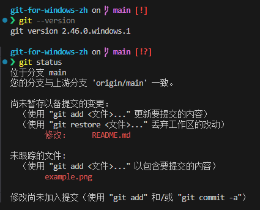

# git-for-windows 中文语言包使用指南



本项目为 [`git-for-windows`](https://github.com/git-for-windows/git) 提供中文语言支持，您可以通过以下方法安装并使用。

## 前提条件
首先，需要设置系统默认编码为utf-8。具体方法如下：

请转到 Windows“设置”>“时间和语言”>“语言和区域”>“管理语言设置”>“更改系统区域设置”，然后选中“Beta：使用 Unicode UTF-8 获得全球语言支持”。 然后重新启动电脑，使更改生效。

## 安装方法

### 方法一：一键安装脚本（推荐）

#### 步骤 1：以管理员身份运行 PowerShell

1. 点击开始菜单，搜索并右键“**Windows PowerShell**”，选择“**以管理员身份运行**”。

#### 步骤 2：执行安装命令

在 PowerShell 中粘贴以下命令并按回车：

```powershell
Invoke-WebRequest -Uri "https://cdn.jsdelivr.net/gh/zkl2333/git-for-windows-zh@main/apply_git_language_pack.ps1" -OutFile "$env:TEMP\apply_git_language_pack.ps1"; PowerShell -ExecutionPolicy Bypass -File "$env:TEMP\apply_git_language_pack.ps1"; Remove-Item -Path "$env:TEMP\apply_git_language_pack.ps1" -Force
```

此命令将自动为您的 Git 版本安装中文语言文件。

#### 步骤 3：重启 Git Bash 并验证

关闭所有 Git Bash 窗口，重新打开后运行：

```bash
git status
```

若输出为中文，安装成功。

### 方法二：手动安装

#### 步骤 1：下载语言文件

1. 访问 [Releases](https://github.com/zkl2333/git-for-windows-zh/releases) 页面。
2. 下载与您 Git 版本对应的语言文件 ZIP 包。

#### 步骤 2：解压并复制文件

1. 解压 ZIP 包。
2. 将解压后的 `mingw64` 文件夹复制到 Git 安装目录（默认 `C:\Program Files\Git`），选择“替换目标中的文件”。

#### 步骤 3：设置环境变量

将 Git bash 环境中的 `LANG` 环境变量设置为 `zh_CN.UTF-8`：

##### 方式1：bash profile

1. 打开`$env:USERPROFILE\.bash_profile`。
2. 在文件适当位置添加一行`export LANG=zh_CN`，通常是在`test -f ~/.bashrc && . ~/.bashrc`之后。

##### 方式2：系统环境变量

1. 右键“此电脑”，选择“属性”。
2. 点击“高级系统设置” > “环境变量”。
3. 新建环境变量：
   - **变量名**：`LANG`
   - **变量值**：`zh_CN.UTF-8`

#### 步骤 4：配置 Git 编码

在 Git Bash 中执行：

```bash
git config --global core.quotepath false
git config --global gui.encoding utf-8
git config --global i18n.commitencoding utf-8
git config --global i18n.logoutputencoding utf-8
```

#### 步骤 5：重启并验证

重启 Git Bash，运行 `git status`，若输出为中文，安装完成。

## 常见问题

- **输出仍为英文？**

  - 确认 `LANG` 环境变量已设置为 `zh_CN.UTF-8`。
  - 确认语言文件正确安装。
  - 重启 Git Bash。

- **出现乱码？**

  - 确认已配置 Git 编码为 UTF-8。

- **想恢复英文界面？**
  - 删除语言文件和 `LANG` 环境变量。
  - 重启 Git Bash。

## 注意事项

- **版本匹配**：确保语言文件版本与 Git 版本一致。
- **备份**：安装前可备份原始文件。

## 卸载语言包

1. 删除 Git 安装目录中的中文语言文件：
   - `mingw64\share\locale\zh_CN\LC_MESSAGES\git.mo`
   - `mingw64\share\git-gui\lib\msgs\zh_cn.msg`
   - `mingw64\share\gitk\lib\msgs\zh_cn.msg`
2. 删除或修改 `LANG` 环境变量。
3. 重启 Git Bash。

---

如有疑问，欢迎在 [本仓库](https://github.com/zkl2333/git-for-windows-zh) 提交 Issue。

## 许可证

本项目采用 MIT 许可证，详情参见 [LICENSE](https://github.com/zkl2333/git-for-windows-zh/blob/main/LICENSE)。

## 致谢

- 感谢 [`git-for-windows/git`](https://github.com/git-for-windows/git) 项目。
- 感谢 [`toyobayashi/git-zh`](https://github.com/toyobayashi/git-zh) 项目。
- 感谢 GitHub Actions 社区。
